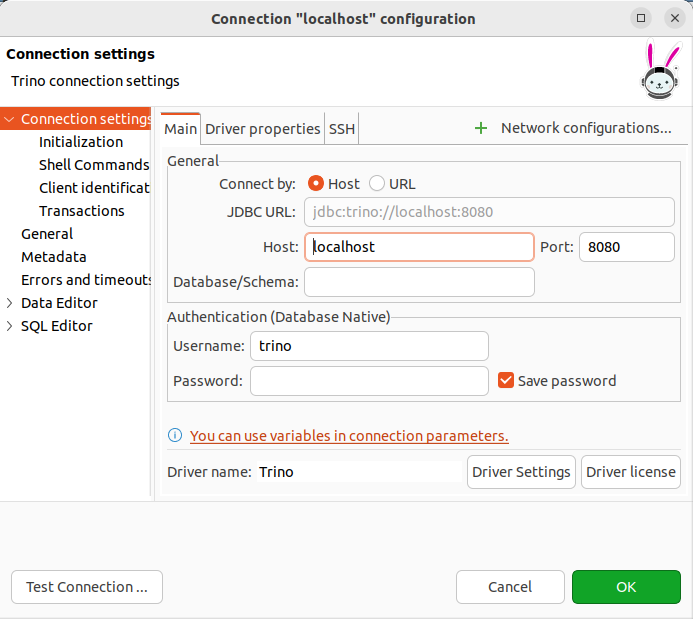

# How-to Guide

## Start our data lake infrastructure
```shell
docker compose -f docker-compose.yml -d
```

## Generate data and push them to MinIO
### 1. Generate data
```shell
python utils/generate_fake_data.py
```
### 2. Push data to MinIO
```shell
python utils/export_data_to_datalake.py
```

**Note:** Don't forget to install dependencies from `requirements.txt` first (and we use `python 3.9`).

## Create data schema
After putting your files to `MinIO``, please execute `trino` container by the following command:
```shell
docker exec -ti datalake-trino bash
```

When you are already inside the `trino` container, typing `trino` to in an interactive mode

After that, run the following command to register a new schema for our data:

```sql
CREATE SCHEMA IF NOT EXISTS lakehouse.iot_time_series
WITH (location = 's3://iot-time-series/');

CREATE TABLE IF NOT EXISTS lakehouse.iot_time_series.pump (
  event_timestamp TIMESTAMP(3) WITH TIME ZONE,
  pressure DOUBLE,
  velocity DOUBLE,
  speed DOUBLE
) WITH (
  location = 's3://iot-time-series/pump/part_0'
);
```

## Query with DBeaver
1. Install `DBeaver` as in the following [guide](https://dbeaver.io/download/)
2. Connect to our database (type `trino`) using the following information (empty `password`):
  